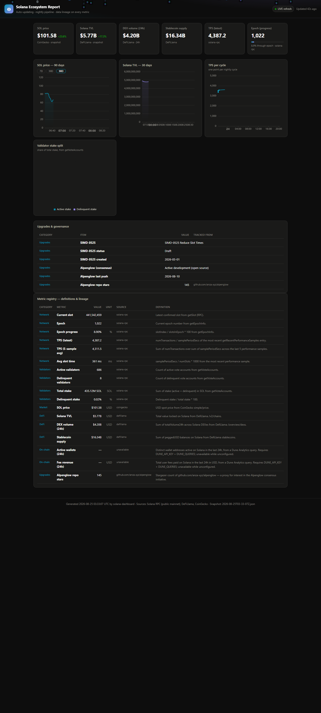

# Solana Ecosystem Auto-Updating Report & Interactive Dashboard

> A nightly pipeline that collects Solana ecosystem metrics from Solana RPC,
> DeFiLlama, CoinGecko, and the GitHub API — and turns them into an interactive
> dark-themed dashboard, a Markdown report with an auto-generated changelog,
> and machine-readable JSON. The repository updates itself: every commit from
> the bot is a new data cycle.
>
> Entry for the **Superteam Canada bounty** — *Develop Solana Ecosystem
> Auto-Updating Report & Interactive Dashboard*.



## Live demo

- **Dashboard** — [riglanto.github.io/solana-dashboard](https://riglanto.github.io/solana-dashboard/)
- **Report** — [report.md](https://riglanto.github.io/solana-dashboard/report.md)
- **Machine-readable JSON** — [latest.json](https://riglanto.github.io/solana-dashboard/latest.json)

Served from this repository's GitHub Pages. No server, no API keys, no hosting
cost — the pipeline runs on GitHub Actions and commits its own output.

## How this meets the brief

| Brief requirement | Implementation |
|---|---|
| Collect metrics: TPS, slot time, epoch, validator health | Solana RPC (`getSlot`, `getEpochInfo`, `getVoteAccounts`, `getRecentPerformanceSamples`) |
| DeFi data (TVL, DEX volume, stablecoins) | DeFiLlama `/v2/chains`, `/overview/dexs`, `stablecoins` |
| Market data (SOL price) | CoinGecko `simple/price` + 90-day history for charts |
| **Auto-updating** report & dashboard | Nightly GitHub Actions cron (03:23 UTC) → commits regenerated artifacts; commit history is the proof |
| Machine-readable output | `reports/latest.json` — every metric carries value, unit, source, collection time, and a documented definition |
| Extensible beyond the minimum | Upgrade tracking (SIMD-0525 status, Alpenglow consensus repo), metric registry with lineage, config-gated Dune Analytics adapter |

## What makes it stand out

- **The report narrates its own evolution.** `report.md` diffs the two most
  recent snapshots and writes a human-readable changelog — TPS moved +5.0%,
  epoch advanced, a SIMD moved from Draft to Accepted, a metric was first
  measured. No stale dashboard: every row says when it was collected.
- **Provenance on every number.** A normalized metric registry
  (`core/schema.py`) is the single source of truth: each metric carries a
  definition, unit, category, source, and `collected_at` timestamp. This is
  the standardization gap the Solana Foundation's Open Data Platform was
  built to address — implemented here for the ecosystem's core numbers.
- **Graceful degradation.** One flaky API never fails the night: each
  collector is isolated, missing metrics are marked unavailable, and the
  pipeline only exits non-zero when required metrics vanish.
- **Upgrade tracker.** The dashboard and report follow SIMD-0525 (*Reduce
  Slot Times*) through the proposal lifecycle and track `anza-xyz/alpenglow`
  (the community consensus client) via stars and push activity — a proxy for
  where Solana is heading, not just where it is.
- **Zero infrastructure.** Static-first: one self-contained HTML file with
  inlined ECharts. Works offline, renders anywhere, and GitHub Pages serves
  it for free.

## Quick start

Requires Python ≥ 3.11 and [uv](https://docs.astral.sh/uv/).

```bash
uv sync
uv run python -m solana_dashboard collect   # one full data cycle → SQLite + snapshot
uv run python -m solana_dashboard render    # regenerate dashboard.html / report.md / latest.json
uv run python -m solana_dashboard serve     # local preview → http://127.0.0.1:8000/dashboard.html
```

Run the tests:

```bash
uv run pytest          # 29 tests: RPC parsing, snapshot diffing, delta formatting, Dune mapping
```

## Outputs

| Artifact | Description |
|---|---|
| `reports/dashboard.html` | Interactive dashboard — KPI tiles, SOL price 7/30/90-day toggle, TVL & TPS charts, validator stake donut, upgrades & governance card, full metric registry, animated token-logo hero. Live price refresh every 60 s. |
| `reports/report.md` | Auto-updating report — executive summary, *What changed* changelog, per-category tables, methodology, metric definitions appendix. |
| `reports/latest.json` | Machine-readable snapshot with full lineage (schema `data/snapshots/*.json`; SQLite history in `data/solana.db`). |

## Architecture

```
src/solana_dashboard/
├── collectors/      # one adapter per source
│   ├── rpc.py           # Solana JSON-RPC (slot, epoch, validators, TPS)
│   ├── defillama.py     # TVL, DEX volume, stablecoin supply
│   ├── coingecko.py     # SOL spot price (+ history for charts)
│   ├── dune.py          # on-chain activity (optional — needs API key)
│   └── solana_data.py   # upgrade tracker: SIMD proposals + Alpenglow (GitHub API)
├── core/
│   ├── schema.py        # metric + state registry — single source of truth
│   ├── store.py         # SQLite history + JSON snapshots
│   └── pipeline.py      # cycle orchestration, reporting, required-metric checks
└── render/
    ├── dashboard.py     # single-file dark HTML (inlined ECharts, validated palette)
    ├── report.py        # Markdown report + snapshot diff / auto-changelog
    └── export.py        # copies the newest snapshot to reports/latest.json
```

The auto-update loop:

```
nightly cron (03:23 UTC)
   → collect (15 metrics + 7 state entries across 4 sources)
   → render (dashboard.html, report.md, latest.json)
   → commit artifacts back to the repo
   → GitHub Pages serves the new cycle
```

## Data sources & metrics

| Category | Metrics | Source |
|---|---|---|
| Network | TPS (latest + 5-sample avg), avg slot time, current slot, epoch, epoch progress | Solana RPC (public mainnet) |
| Validators | Active / delinquent counts, total stake, delinquent stake % | Solana RPC |
| Market | SOL price (USD) | CoinGecko |
| DeFi | TVL, DEX volume 24h, stablecoin supply | DeFiLlama |
| On-chain | Active wallets (24h), fee revenue (24h) | Dune Analytics (optional — see below) |
| Upgrades | SIMD-0525 status & creation date, Alpenglow repo stars & last push | GitHub API |

Methodology notes are embedded in the report (`Sources & methodology`) and in
every metric's definition in the registry. Notable API quirks handled: DeFiLlama's
`/overview/dexs` ignores `?chain=` (protocols are filtered client-side) and its
stablecoin endpoint moved to `chainCirculating` (with a legacy fallback).

## Optional: Dune Analytics (on-chain activity)

The pipeline ships with a config-gated Dune adapter for metrics the free
sources don't expose — active wallets and fee revenue. Activate it with a
free Dune API key and your own queries:

```bash
export DUNE_API_KEY='...'   # free community tier: dune.com/settings/api
export DUNE_QUERIES='{"dune.active_wallets_24h": {"query_id": 123456, "column": "active_wallets"},
                      "dune.fee_revenue_24h_usd": {"query_id": 123457, "column": "fee_revenue"}}'
uv run python -m solana_dashboard collect
```

The query ID and column name come from your Dune query's result schema.
Without these variables the adapter stays quiet — the On-chain rows are
marked unavailable, the required metrics are unaffected, and the cycle
runs normally.

## Roadmap

- [x] Week 1 — pipeline: collectors, schema, SQLite history, snapshots, CI
- [x] Week 2 — dashboard, Markdown report + auto-changelog, upgrade tracker
- [x] Week 3 — Dune Analytics adapter (config-gated swap-in source)
- [ ] Longer history charts, live API on Render free tier (optional)

## License

MIT
